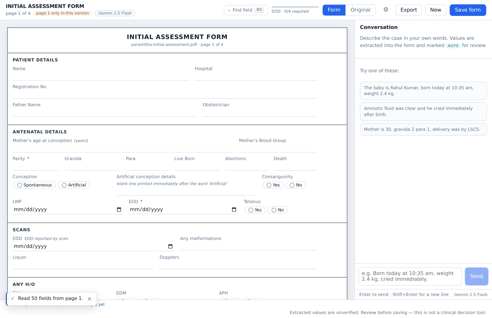
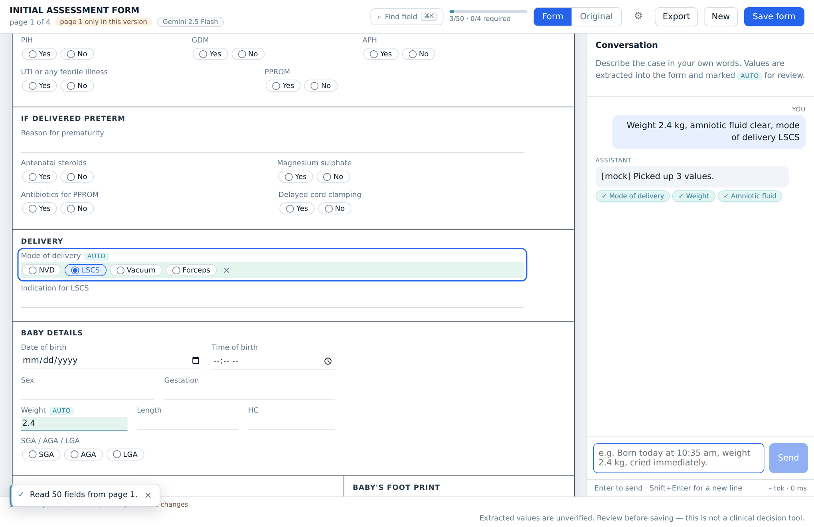
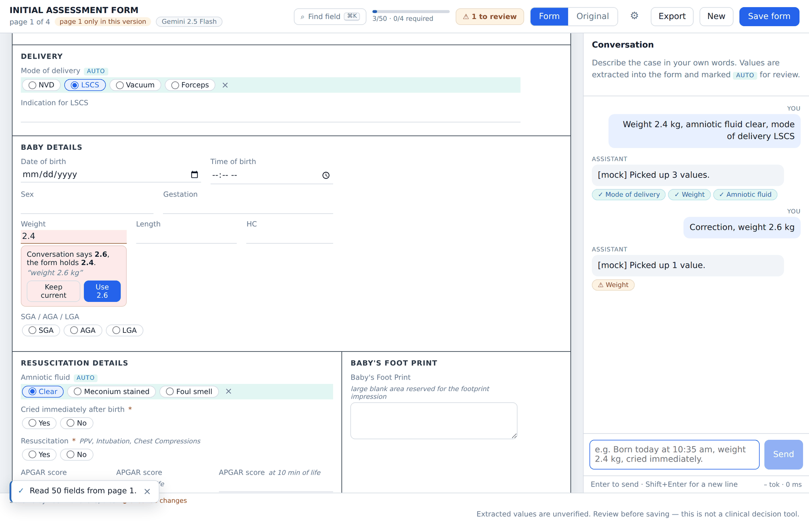
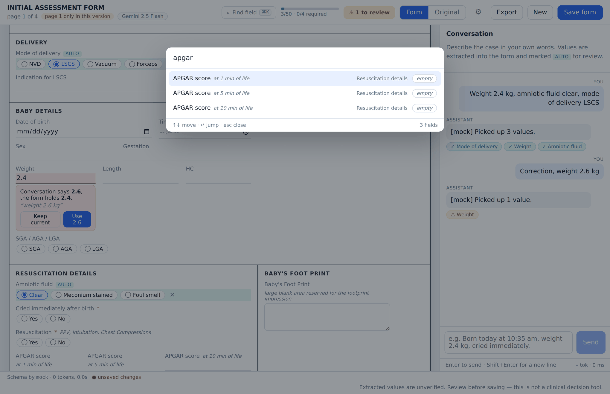
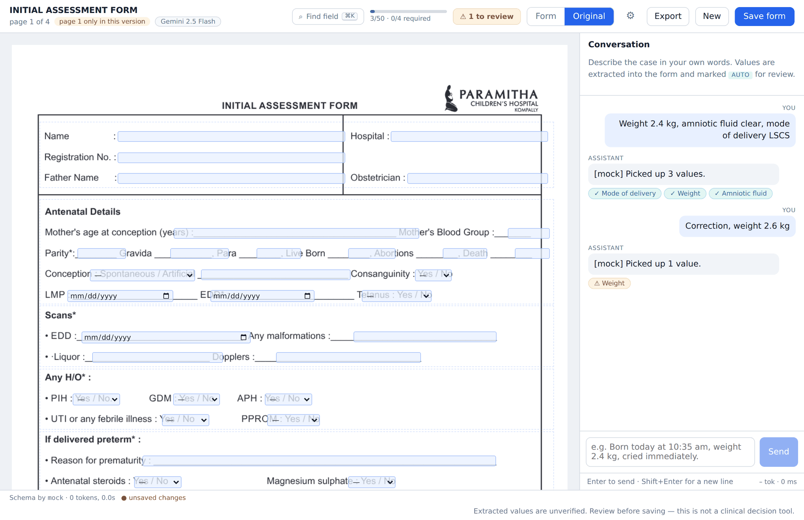
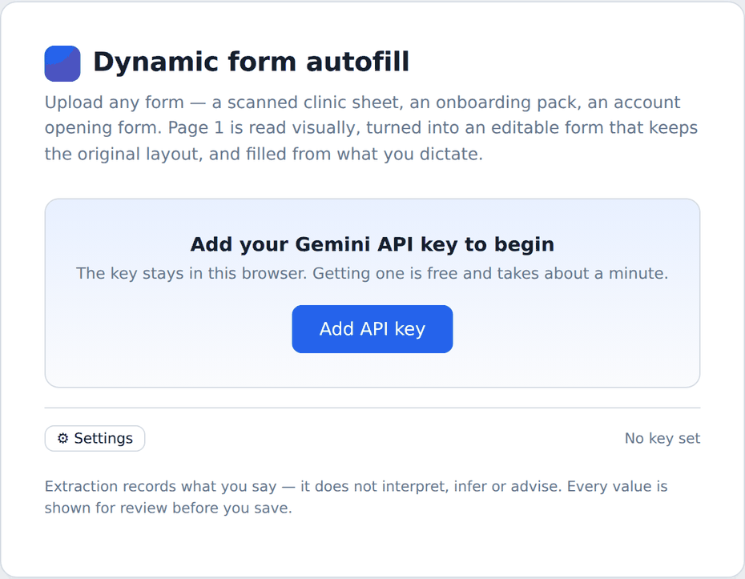
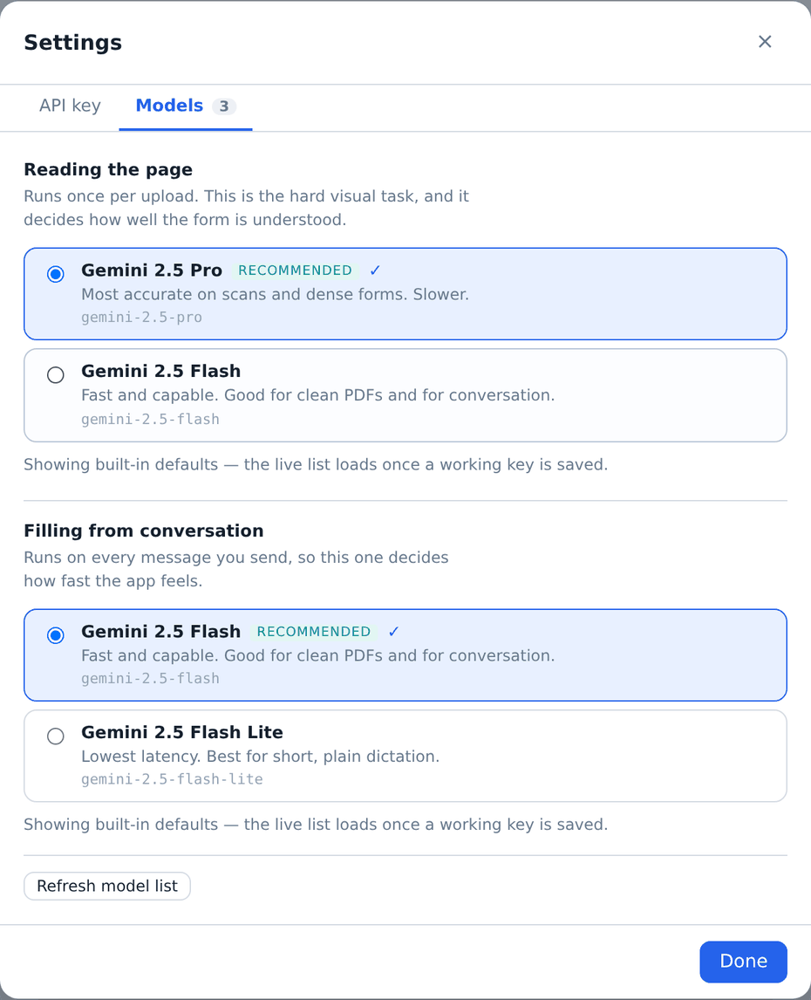

# Dynamic form autofill

Upload **any** form — a scanned clinic sheet, an onboarding pack, an account
opening form. Gemini reads the pages visually, they become an editable digital
form that keeps the original layout, and dictating the case fills the fields.

The application has **no built-in knowledge of any form**. There is no
`patientName`, no `dateOfBirth`, no clinical vocabulary in the code. Structure is
data produced at runtime by the model and consumed by generic renderers,
validators and state machinery. A different document tomorrow needs zero code
changes.

```
        ANY FORM ──► pages ──► Gemini vision ──► JSON schema ──► dynamic UI
                                                        │
                        conversation ──► gate ──► Gemini extraction ──► validate
                                                        │
                                          conflicts ──► human review ──► save
```

---

## What it looks like

> Captured from the running app. The conversation panel shots use the offline
> fixture mode, so the assistant replies are prefixed `[mock]` — with a real key
> the reply is a sentence from the model. Everything else is identical.

**The form, rendered from the uploaded page.** Sections, rows and column widths
are derived from the detected geometry, so *Baby details* sits beside *Baby's
foot print* and `Parity / Gravida / Para / Live Born / Abortions / Death` share
one row — as printed.



**Filled from conversation.** Extracted values are badged `auto` and the reply
carries a chip per field it touched; clicking a chip jumps to that field.



**A restatement that disagrees becomes a conflict, not an overwrite.** The
existing value stays until a human decides, with the verbatim phrase it came
from shown underneath.



**⌘K jumps to any field.** Items awaiting a decision sort first, and the printed
context is shown — which is what separates the three fields all labelled *APGAR
score*.



**Mode B keeps the original page.** The same live fields, positioned over the
detected blanks using the coordinates already in the schema.



**The key and models are set in the app.** Upload is gated until a key is
present; the key is checked against Google before it is accepted, and the model
list is what your key can actually run.

<p align="center">
  
  
</p>

---

## Run it locally

**Prerequisites:** Node 20.11+ and a Gemini API key from
[aistudio.google.com/apikey](https://aistudio.google.com/apikey) (free).

```bash
npm install
npm run dev                  # API on :4000, UI on :5173
```

Open <http://localhost:5173> and paste your key into **Settings** when the app
asks. No `.env` editing, no restart: the key is entered in the app, checked
against Google before it is accepted, kept in your browser, and sent on the
requests that need it. The server never stores it.

If you would rather run headless — for curl, CI or a shared deployment — set
`GEMINI_API_KEY` on the server instead and the app will use that:

```bash
cp .env.example server/.env && $EDITOR server/.env
```

**Without an API key** — the whole UI, validator, conflict logic and HTTP surface
run against a captured fixture:

```bash
MOCK_GEMINI=true npm run dev
```

Mock mode renders the sample form regardless of what you upload (it is a
fixture), and its stand-in extractor is a crude keyword matcher — deliberately
much dumber than the real model. Because the fixture is a captured *page 1*
response, every analyzed page renders the same fields (distinguished by the
`_p2` id suffix), which is useful for exercising the page switcher but is not
what a real two-page form looks like. It is for UI work and offline demos.

Other commands:

```bash
npm test          # 14 unit tests: validation, conflicts, gate, layout,
                  # id uniqueness across pages, box conversion, type repair
npm run build     # typecheck + build all three workspaces
npm start         # run the built server
```

## Test it with the attached PDF

The document is committed at `samples/paramitha-initial-assessment.pdf` (4 pages;
**the first 2 are processed** by default — see `MAX_ANALYZED_PAGES`).

**In the UI:** add your key in Settings, drop the PDF on the upload screen, wait
for the analysis, then paste into the conversation panel:

> The baby is Rahul Kumar, born today at 10:35 AM. He is male and weighs 2.4
> kilograms. He cried immediately after birth.

Fields fill and are badged `auto`. Then try each guard:

| Say this | What should happen |
|---|---|
| `Amniotic fluid was meconium-stained.` | Matches the printed option `Meconium stained` |
| `Mother's age at conception is about 30.` | **Not** filled — hedged speech parks as *needs clarification* |
| `Correction, the weight is 2.6 kg.` | **Conflict** — the old value stays until you choose |
| `The amniotic fluid was greenish.` | Rejected — not one of the printed choices |
| `Start him on ampicillin.` | Dropped — the form has no such field |
| `ok thanks` | Gated locally — no API call at all |

Each reply carries chips for the fields it touched — click one to jump straight
to that field, switching page if it landed on the other one. The toolbar shows
live progress across both pages and a **to review** button that walks you through
anything awaiting a decision.

Press **⌘K** to jump to any field by name, on either page. The **Page 1 /
Page 2** tabs switch pages, and a dot on a tab marks something there needing
review. Switch to **Original** to see the same live fields overlaid on the real
page (Mode B). Every field is editable by hand; a hand-edited field can never be
silently overwritten.

| Shortcut | |
|---|---|
| `⌘K` / `Ctrl-K` | Find and jump to a field |
| `⌘S` / `Ctrl-S` | Save the form |
| `⌘/` / `Ctrl-/` | Focus the conversation box |
| `Enter` / `Shift+Enter` | Send / newline, in the conversation box |
| `Esc` | Close a dialog |

**From the shell:**

```bash
./scripts/smoke-test.sh                  # against a server on :4000
BASE=http://localhost:4000 FILE=my-form.pdf ./scripts/smoke-test.sh
```

---

## Documentation

| | |
|---|---|
| [`docs/ARCHITECTURE.md`](docs/ARCHITECTURE.md) | Pipeline, technology choices, model selection and why it is fast, coordinates, layout reconstruction, trust boundary |
| [`docs/API.md`](docs/API.md) | Every endpoint with example requests and responses |
| [`docs/PROMPTS.md`](docs/PROMPTS.md) | Both prompts, both structured-output schemas, the validation table, the gate |
| [`docs/example-schema.paramitha-page1.json`](docs/example-schema.paramitha-page1.json) | The real generated schema for the attached form: 9 sections, 50 fields |
| [`docs/example-conversation.md`](docs/example-conversation.md) | Seven worked conversation → field examples, including a non-clinical form |
| [`docs/screenshots/`](docs/screenshots) | Screens captured from the running app |

## Layout

```
shared/     types, deterministic validation, layout reconstruction,
            state transitions, the relevance gate   ← no framework, no I/O
server/     Express API, document ingest, Gemini calls, prompts,
            response schemas, normalization, storage and caching
web/        React UI: upload, Mode A form renderer, Mode B overlay,
            conversation panel, framework-independent session store
```

Validation, conflict rules and layout live in `shared/` because both the server
and the client need them — the client runs the same gate before spending a
request, and would run the same validators for optimistic updates.

## What it does

**Understands the page visually.** Sections, ruled blanks, printed choice lists,
tables, borders, several fields per line, and the position of every one of them.
`Amniotic fluid : Clear / Meconium stained / Foul smell` becomes one radio field
with three options, not three fields. `Cried immediately after birth : Yes / No`
becomes a boolean.

**Keeps the layout.** The model reports positions; row and column structure is
derived from them deterministically. On the sample, *Baby details* renders beside
*Baby's foot print*, and `Parity / Gravida / Para / Live Born / Abortions /
Death` render on one row — as printed.

**Two rendering modes.** Mode A is the dynamic HTML form (primary). Mode B keeps
the original page as the background with live inputs over the detected blanks.
Mode B needed no schema change to build, because coordinates were normalized into
the schema from the first commit.

**Fills from conversation, cheaply.** The document is sent to a model exactly
once. Every later turn sends a compact catalogue of the fields that are still
open plus the last few turns — so a session gets *cheaper* per turn as the form
fills, not more expensive.

**Never invents a clinical value.** Hedged speech is parked, not confirmed.
Ambiguous dates are rejected, not guessed. A number for a field whose document
prints a unit asks for the unit rather than assuming one. An existing value is
never overwritten from conversation. Every automatic value shows the verbatim
phrase it came from, and a human reviews before saving.

> This is an information-extraction and form-completion tool. It is not a
> clinical decision-support system, and it makes no findings of its own.

## Token and latency strategy

| Lever | Effect |
|---|---|
| Document sent once, never re-sent | The dominant cost is paid once per document |
| Analysis cached on `(content hash, page, model)` | Re-uploading the same file costs zero model calls |
| Local relevance gate | Small talk never reaches the API — no tokens, no round trip |
| Catalogue holds open fields only | Per-turn input **shrinks** as the form fills |
| Last 6 turns, not the whole transcript | Bounded context growth |
| Client-side debounce (600 ms) + batching | A burst of dictated lines is one call, not five |
| `thinkingBudget: 0` on extraction | The biggest single lever on time-to-first-token |
| `maxOutputTokens: 2048`, one short string per field | Small responses by construction |
| Optimistic manual edits | Typing never waits on a round trip |
| Model list cached 10 min per key | The picker opens instantly after the first load |
| In-flight request superseding | A newer burst aborts a stale one |
| pdf.js code-split out of the main bundle | 168 KB initial JS instead of 534 KB |

## Error handling

Malformed model JSON is repaired then rejected locally; a response that does not
match the expected shape is a `502` with the zod issues attached, never a broken
form. Transient upstream failures (429/5xx/network) retry with exponential
backoff. Field ids the model invents are dropped before validation. Values that
fail type parsing are reported as `rejected` with a reason and never displayed as
form data. Uploads that are not PDF/PNG/JPEG/WebP are refused by content sniffing,
not by file extension. Encrypted and malformed PDFs, empty pages and pages where
no field was found each get their own status and message. Manual edits roll back
in the UI if the write fails.

## Page scope

`MAX_ANALYZED_PAGES` decides how many leading pages are read. It ships at **2**.
Each page is one model call and the calls run **concurrently**, so widening the
scope costs tokens rather than wall-clock time. Documents with fewer pages are
unaffected.

Everything is keyed by page number — `schema.pages[]`,
`state.pages[pageNumber][fieldId]`, per-page assets, a per-page analysis cache,
and the UI's page tabs — so that number is the only thing to change.

Two consequences worth knowing:

- **Field ids are unique across the document**, not only within a page. A form
  that prints "Name" on every page would otherwise have every page's value land
  on the first one; later duplicates are suffixed (`name_p2`).
- **Conversation fills the whole document, not just the page on screen.**
  Extraction searches every analyzed page, and when a value lands on another page
  the UI follows it there. Progress, the review count and ⌘K all span pages.

## Settings, in the app

The Gemini key and both model choices are set in the app's **Settings** dialog,
not in a config file:

- **Key entry is checked before it is accepted.** The app calls `countTokens`,
  which is free, so a mistyped key fails in the dialog in under a second instead
  of surfacing as a failed upload half a minute later.
- **The key stays in the browser** (`localStorage`), is sent as
  `x-gemini-api-key` on the requests that need it, and is never written to disk
  or into a form record by the server. It is always displayed masked, with a
  one-click **Forget key**.
- **Models are listed live from your key's project.** The picker calls Google's
  model list, so it offers exactly what your key can run — no dead options, and
  new models appear without a release. A static list is the fallback if the call
  fails, so the picker is never empty.
- **Model choice is per-role** — one for reading the page, one for the
  conversation — presented as cards with the trade-off next to each name, since
  the consequence of the choice is not guessable from a model id. A stored choice
  that is no longer available silently falls back to the best option for its role
  instead of failing on the next upload.
- **Failures route back to Settings.** A rejected key, an unavailable model or a
  missing key reopens the dialog with the reason at the top, rather than dead-
  ending in a red banner.

`GEMINI_API_KEY` in the environment still works and is used when the browser
supplies none, which is what keeps curl and the smoke test working.

## Configuration

See [`.env.example`](.env.example). The essentials:

| Variable | Default | |
|---|---|---|
| `GEMINI_API_KEY` | — | optional fallback; normally the key is set in the app |
| `GEMINI_ANALYSIS_MODEL` | `gemini-2.5-pro` | once per page; the hard visual task |
| `GEMINI_EXTRACTION_MODEL` | `gemini-2.5-flash` | every turn; in the critical path |
| `GEMINI_EXTRACTION_THINKING_BUDGET` | `0` | thinking off for latency |
| `MAX_ANALYZED_PAGES` | `2` | leading pages read per upload; one model call each, run in parallel |
| `MOCK_GEMINI` | `false` | offline fixture mode |

Uses the official **`@google/genai`** SDK (v2) with multimodal input and
structured outputs on both calls. The deprecated `@google/generative-ai` package
is not used.
